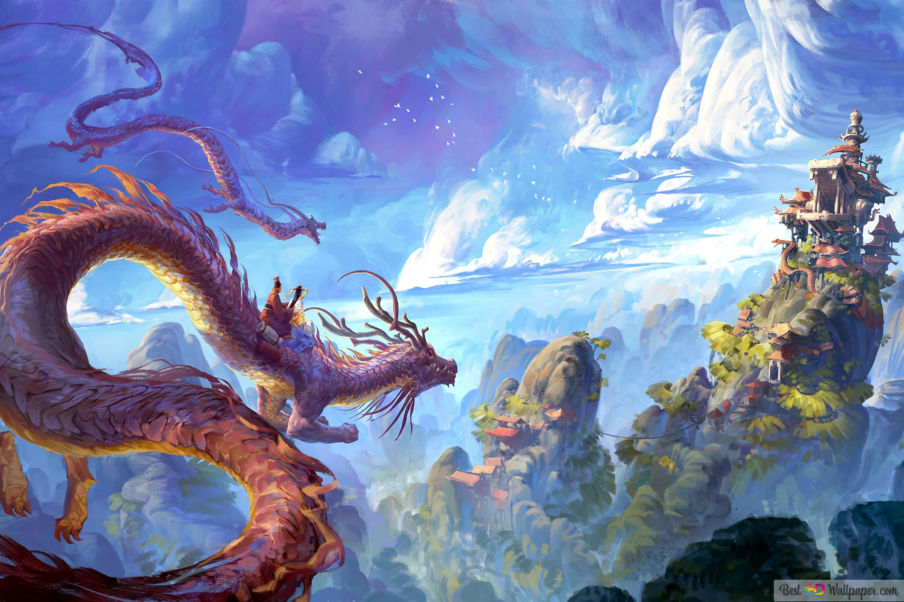

<!--- Concatenation of site URL to frontmatter image  --->

<!--- Has is a list variable containing mario metadata for sprite --->

<!--- Size width/height of Sprit images --->


<!--- HTML for page contains 
 tag named "Mario" and class properties for a "sprite"  -->

  
<!--- Embedded Cascading Style Sheet (CSS) rules, 
        define how HTML elements look 
--->

<!--- Embedded executable code--->

<html lang="en">
<head>
    <meta charset="UTF-8">
    <meta http-equiv="X-UA-Compatible" content="IE=edge">
    <meta name="viewport" content="width=device-width, initial-scale=1.0">
    <title>My Journey</title>
    
    

</head>
<body>
    <h3>My Journey</h3>
    

     

     

    

    
    

      

      

    

    

        

            When setting up the tools, the biggest problem I encounter is the problem of root. Which is most possibly caused by me forgetting the first username and password. First, I tried to check my username on terminal, but only my username show, which is my first account "collin". After that, I find out that the password does not show and I don't know how to edit it. I choose to create a new account name "Qixiang" and set up the password and username. But it still shows the root in front of my account. At last, I tried deleting everything and follow from step one and see if it fix, then I download everything I need and download the vs code, then it finally work and it quit root.
        

        

        - Good luck! 😊
        

    

</body>

  <button class="button">Menu &nbsp; ▼</button>
  

    <a id="top" href="{{site.baseurl}}/cspcalendar/">Calendar</a>
    

        <a id="middle" href="https://nighthawkcoders.github.io/portfolio_2025/javascript/project/play">Javascript cell &nbsp; ▶</a>
        

            <a href="{{site.baseurl}}/cookieclicker/">Cookie clicker</a>
            <a href="{{site.baseurl}}/calculator/">Calculator</a>
            <a href="{{site.baseurl}}/snake/">Snake Game</a>
            <a href="{{site.baseurl}}/jupyternotebook/">Jupyter Notebook</a>
        

    

    <a id="bottom" href="{{site.baseurl}}/about/">About Pages</a>
  

  

  
  

    <button>CSP Button</button>
    

     

     

    

     <a href="https://nighthawkcoders.github.io/portfolio_2025/navigation/section/csp" class="nklink">
      <button>Nighthawk Instruction</button>
     </a>
    

     

     

     <a href="https://nighthawkcoders.github.io/portfolio_2025/devops/tools/home" class="nklink">
      <button>CSP Tool Setup</button>
     </a>
    

  

  

    

    <a href="{{site.baseurl}}/snake/" class="nklink">
      <button>Snake Game</button>
    </a>
  

  

    

    <a href="{{site.baseurl}}/threeandfive/" class="nklink">
      <button>3.3 and 3.5 hacks</botton>
  

  

  

  

</html>

