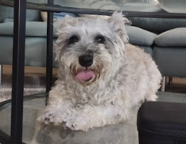

<html lang="en">
<head>
    <meta charset="UTF-8">
    <meta http-equiv="X-UA-Compatible" content="IE=edge">
    <meta name="viewport" content="width=device-width, initial-scale=1.0">
    
</head>
<body>
    

        

    

    

        

            
            
            
        

    

    

        

        

        
 
        Hi, my name is Collin Ge. I am an 11th grade student in Del Norte High school. I have a family of four people and one dog. What I like to do in my daily life is to find delicious food and learn how to cook them. I also like making stuff out of wood. I like a lot of things about engineer and hope to get a career about this. I am very into the creation of both nature and human, looking at those beautiful scene make me feel calm and relax. Everytime staying in home, especially if there is rain, make my day wonderful and complete.
        

        <ul>
            <li>I am an immigrant who moved here 5 years ago 🛫</li>
            <li>I have 1 older brother who works 👨‍💼</li>
            <li>My goal is to get into a decent college 🎓</li>
            <li>My life goal is to have a calm life with family 🏡</li>
        </ul>
    

    

        
    

    <!-- Gallery Section -->
    

        
         
        
        
        
    

   
</body>
</html>

